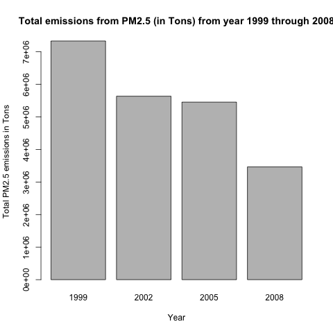
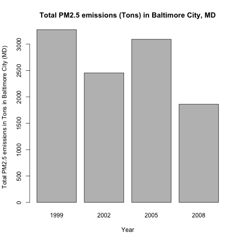
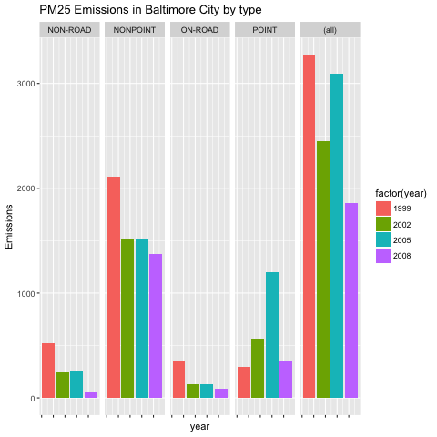
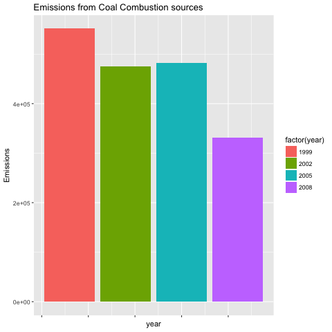
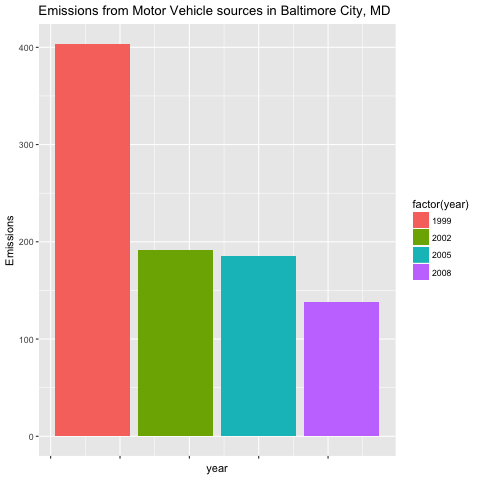
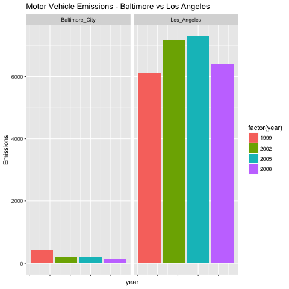

# This is Course Project 2 for Exploratory Data Analysis course
## Data
The data for this assignment includes:
  
### PM2.5 Emissions Data (𝚜𝚞𝚖𝚖𝚊𝚛𝚢𝚂𝙲𝙲_𝙿𝙼𝟸𝟻.𝚛𝚍𝚜):
This file contains a data frame with all of the PM2.5 emissions data for 1999, 2002, 2005, and 2008. For each year, the table contains number of tons of PM2.5 emitted from a specific type of source for the entire year. Here are the first few rows.

𝚏𝚒𝚙𝚜: A five-digit number (represented as a string) indicating the U.S. county
𝚂𝙲𝙲: The name of the source as indicated by a digit string (see source code classification table)
𝙿𝚘𝚕𝚕𝚞𝚝𝚊𝚗𝚝: A string indicating the pollutant
𝙴𝚖𝚒𝚜𝚜𝚒𝚘𝚗𝚜: Amount of PM2.5 emitted, in tons
𝚝𝚢𝚙𝚎: The type of source (point, non-point, on-road, or non-road)
𝚢𝚎𝚊𝚛: The year of emissions recorded

### Source Classification Code Table (𝚂𝚘𝚞𝚛𝚌𝚎_𝙲𝚕𝚊𝚜𝚜𝚒𝚏𝚒𝚌𝚊𝚝𝚒𝚘𝚗_𝙲𝚘𝚍𝚎.𝚛𝚍𝚜):
This table provides a mapping from the SCC digit strings in the Emissions table to the actual name of the PM2.5 source. The sources are categorized in a few different ways from more general to more specific and you may choose to explore whatever categories you think are most useful. For example, source “10100101” is known as “Ext Comb /Electric Gen /Anthracite Coal /Pulverized Coal”.

## Assignment
The overall goal of this assignment is to explore the National Emissions Inventory database and see what it say about fine particulate matter pollution in the United states over the 10-year period 1999–2008. 

## Questions
The following questions are addressed in the exploratory analysis.
For each question/task a plot is generated and saved as a PNG.

1. Have total emissions from PM2.5 decreased in the United States from 1999 to 2008? Base plotting system is used here to make a plot showing the total PM2.5 emission from all sources for each of the years 1999, 2002, 2005, and 2008.
 
2. Have total emissions from PM2.5 decreased in the Baltimore City, Maryland (𝚏𝚒𝚙𝚜 == "𝟸𝟺𝟻𝟷𝟶") from 1999 to 2008? Base plotting system is used to make a plot answering this question.
 
3. Of the four types of sources indicated by the 𝚝𝚢𝚙𝚎 (point, nonpoint, onroad, nonroad) variable, which of these four sources have seen decreases in emissions from 1999–2008 for Baltimore City? Which have seen increases in emissions from 1999–2008? ggplot2 plotting system is used to make a plot answer this question.
 
4. Across the United States, how have emissions from coal combustion-related sources changed from 1999–2008?
 
5. How have emissions from motor vehicle sources changed from 1999–2008 in Baltimore City?
 
6. Compare emissions from motor vehicle sources in Baltimore City with emissions from motor vehicle sources in Los Angeles County, California (𝚏𝚒𝚙𝚜 == "𝟶𝟼𝟶𝟹𝟽"). Which city has seen greater changes over time in motor vehicle emissions?
 

