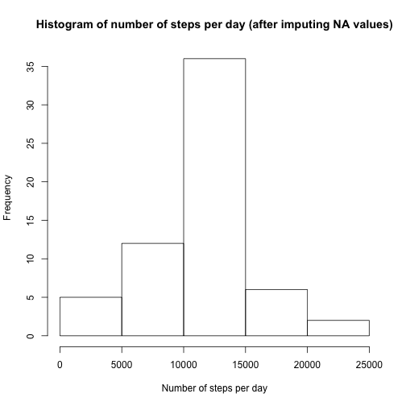

# R Markdown

This is an R Markdown document for the Reproducible Research Course Project 1. This assignment makes use of data from a personal activity monitoring device. This device collects data at 5 minute intervals through out the day. The data consists of two months of data from an anonymous individual collected during the months of October and November, 2012 and include the number of steps taken in 5 minute intervals each day. 

Described below are different R code chunks that can be used to reproduce the step count results in tables and figures.

## Loading and preprocessing the data

### Download and store the data

This R code chunk below describes how to download the activity data and load it using read.csv().

```r
url <- "https://d396qusza40orc.cloudfront.net/repdata%2Fdata%2Factivity.zip"
download.file(url, destfile = "activitydata.zip")
unzip("activitydata.zip", exdir='activity_data',overwrite=TRUE)

activity <- read.csv("activity_data/activity.csv", header=TRUE)
```

### Preprocessing the data

This R code chunk shows how to convert the date from factor into a Date class and how to remove missing values.

```r
library(lubridate)
activity$date <- ymd(activity$date)
activity_nomissing <- activity[!is.na(activity$steps),]
```


## What is mean total number of steps taken per day?

This R code chunk can be used to produce the mean and median of total number of steps taken per day.

```r
total_steps_per_day <- aggregate(steps ~ date, data=activity_nomissing, sum)
```

### Generate mean, median and Histogram of total number of steps per day without NA values
Report mean and median and plot histogram of total number of steps taken per day.

```r
paste("Mean of Total steps per day:", mean(total_steps_per_day$steps))
```

```
## [1] "Mean of Total steps per day: 10766.1886792453"
```

```r
paste("Median of Total steps per day:", median(total_steps_per_day$steps))
```

```
## [1] "Median of Total steps per day: 10765"
```

```r
hist(total_steps_per_day$steps, main="Histogram of number of steps per day (without NA values)", xlab="Number of steps per day")
```


## What is the average daily activity pattern?

This R code chunk can be used to produce the average daily activity pattern, by generating a time series plot of 5-minute interval and the average steps taken, averaged across all days. This will let us identify the 5-minute interval that contains the maximum number of steps


```
## [1] "The 5-minute interval with maximum number of steps:  206.169811320755"
```

Note that the `echo = FALSE` parameter was added to the code chunk to prevent printing of the R code that generated the plot.

## Imputing missing values
Note that there are a number of days/intervals where there are missing values (coded as 𝙽𝙰). The presence of missing days may introduce bias into some calculations or summaries of the data. This R code chunk is used to impute missing values by calculating the mean per 5-minute interval to reduce bias.

```r
missing <- sum(is.na(activity$steps))
paste("The total number of missing values in the dataset is: ", missing)
```

```
## [1] "The total number of missing values in the dataset is:  2304"
```

```r
activity_imputemissing <- activity
mean_per_interval <- function(interval){
  steps_per_interval[steps_per_interval$interval==interval,]$steps
}
activity_imputemissing$impute_steps <- sapply(seq_along(1:length(activity_imputemissing$steps)), function(index){
  if(is.na(activity_imputemissing$steps[index])){
    interval <- activity_imputemissing$interval[index]
    imputed_steps <- mean_per_interval(interval)
  }
  else imputed_steps <- activity_imputemissing$steps[index]
  imputed_steps
})
activity_imputemissing <- activity_imputemissing[,c("impute_steps", "date", "interval")]
impute_steps_per_day <- aggregate(impute_steps ~ date, data=activity_imputemissing, sum)
```

### Generate mean, median and histogram of number of steps after imputing missing values
Now we will make a histogram of the total number of steps taken each day and calculate and report the mean and median total number of steps taken per day. We will compare the mean and median with the estimates from the first part of the assignment without missing values. What is the impact of imputing missing data on the estimates of the total daily number of steps?

```r
paste("Mean of Total steps per day after imputing missing values:", mean(impute_steps_per_day$impute_steps))
```

```
## [1] "Mean of Total steps per day after imputing missing values: 10766.1886792453"
```

```r
paste("Median of Total steps per day after imputing missing values:", median(impute_steps_per_day$impute_steps))
```

```
## [1] "Median of Total steps per day after imputing missing values: 10766.1886792453"
```

```r
hist(impute_steps_per_day$impute_steps, main="Histogram of number of steps per day (after imputing NA values)", xlab="Number of steps per day")
```



We can compare this histogram with the previous histogram with no missing values, and notice that imputing missing values increased the frequency of number of steps between 10,000 and 15,000 from 27 to about 35. The median of total number of steps per day also changed from 10765 to 10766.1886792453, whereas the mean remained the same.


## Are there differences in activity patterns between weekdays and weekends?
In this part of R code, we will use the 𝚠𝚎𝚎𝚔𝚍𝚊𝚢𝚜() function to estimate weekdays based on the date. We will use the dataset with the filled-in missing values for this part.


```r
activity_imputemissing_weekdays <- activity_imputemissing
activity_imputemissing_weekdays$weekday <- weekdays(activity_imputemissing_weekdays$date)
weekdays <- activity_imputemissing_weekdays$weekday
weekdays <- gsub("Monday", "weekday", weekdays)
weekdays <- gsub("Tuesday", "weekday", weekdays)
weekdays <- gsub("Wednesday", "weekday", weekdays)
weekdays <- gsub("Thursday", "weekday", weekdays)
weekdays <- gsub("Friday", "weekday", weekdays)
weekdays <- gsub("Saturday", "weekend", weekdays)
weekdays <- gsub("Sunday", "weekend", weekdays)
activity_imputemissing_weekdays$weekday <- weekdays

activity_per_interval_across_weekdays <- aggregate(impute_steps ~ interval+weekday, data=activity_imputemissing_weekdays, mean)
```

We will use lattice plotting system to plot steps per interval averaged across all weekdays and weekends.

```r
library(lattice)
xyplot(impute_steps ~ interval | weekday, data=activity_per_interval_across_weekdays, type="l", layout=c(1,2), ylab="Number of steps", xlab="Interval")
```


Lets generate the R markdown file using knit2html() function from the knitr package.
